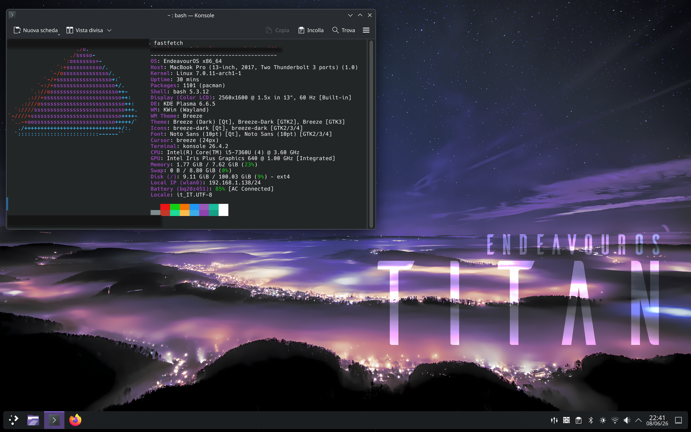

# EndeavourOS Optimization Script for MacBook Pro 2017 (13" Non-Touch Bar)

<p align="center">
  
</p>

A comprehensive post-installation automation script designed to fully optimize **EndeavourOS** (Arch Linux derivative) running on the **MacBook Pro 2017 13-inch, No Touch Bar (Model Identifier: MacBookPro14,1)**. 

This script resolves out-of-the-box hardware issues specific to Apple Intel machines, including native audio amplification, thermal regulation, graphical boot sequencing, and background hardware services.

---

## 📋 Prerequisites & Crucial Installation Notes

Before running this script or installing EndeavourOS, please read these requirements carefully to avoid a non-booting system:

1. **Installation Media Creation:**
   - It is highly recommended to create your live USB installer using a reliable utility like [Ventoy](https://www.ventoy.net/).
   
2. **⚠️ CRITICAL BOOTLOADER REQUIREMENT (DO NOT SKIP):**
   - When running the Calamares installer on EndeavourOS, **you MUST select GRUB as your bootloader**. 
   - **DO NOT use the default `systemd-boot`**. On this specific MacBook Pro hardware architecture, `systemd-boot` causes critical EFI initialization failures, kernel panics, or stuck black screens. Choosing GRUB ensures proper kernel parameter parsing and enables a functional graphical splash screen.

---

## ✨ Features and Automated Optimizations

The script automates five main system layers:

### 1. 🎵 Native Audio Fix (Cirrus Logic CS8409)
MacBook Pro models from this era utilize complex audio codecs that lack native support in standard Linux kernels. This script:
- Installs `dkms` and necessary Linux headers.
- Clones and hooks the specific `snd-hda-macbookpro` driver patch into DKMS.
- Adjusts the build configuration to dynamically compile against modern Linux Kernels (7.x+).
- Ensures your internal speakers and headphone jack work automatically across system updates.

### 2. 🌀 Optimized Dynamic Fan Curve (`mbpfan`)
Apple's default firmware cooling profile favors absolute silence over chip health, causing massive thermal throttling under Linux. The script installs and deploys a customized, aggressively balanced `/etc/mbpfan.conf`:
- **`low_temp = 55`**: Fans begin ramping up early to keep the aluminum unibody cool to the touch.
- **`high_temp = 62`**: Fan curves scale quickly toward maximum velocity under compilation or heavy browsing before thermal throttling kicks in.
- **`max_local_temp = 86`**: High-security threshold protection.
- **`polling_interval = 2`**: Checks system temperature every 2 seconds (instead of the default 7) to mitigate instantaneous Intel Turbo Boost heat spikes.

### 3. 🖥️ Seamless Graphical Boot (Plymouth & GRUB Alignment)
Replaces text-heavy verbose boot logs with a clean, Apple-like user experience:
- Installs `plymouth` and activates the professional `spinner` boot theme.
- Automatically cleans out redundant kernel parameters (like `pcie_ports=compat`) that could cause Wi-Fi instability.
- Safely injects the `splash` parameter into `/etc/default/grub` and regenerates your initramfs images (`dracut` or `mkinitcpio`).

### 4. 🎛️ Studio Quality Sound Presets (EasyEffects DSP)
Internal laptop speakers require software digital signal processing (DSP) equalization to avoid sounding tinny:
- Installs the full `easyeffects` suite along with expert plugins (`lsp-plugins`, `calf`).
- Downloads and deploys the famous **Advanced Audio Gain** acoustic preset mapping tailor-made for flat laptop speakers.

### 5. 🔌 Connectivity Services
- Configures and enables the native `bluetooth` daemon to start automatically at login.

---

## 🛠️ Hardware Workarounds & Known Bugs: The USB-C Port Limitation

If you notice that your USB flash drives or accessories are **not detected when plugged in while the OS is already running** (hot-plugging), this is an unfixable Apple firmware/SMC constraint, not a Linux bug.

### The Cause:
The Apple System Management Controller (SMC) completely shuts down electrical delivery to any empty USB-C/Thunderbolt port during initialization unless it senses an active electrical load at the exact moment the machine boots. 

### ⚠️ CRITICAL KNOWN BUG & WORKAROUND (The USB 3 Hub Requirement):
- To wake up the port and enable hot-plugging, you **MUST use an external USB 3.0 (or higher) Hub**. 
- **IMPORTANT:** Simple USB-C to USB-A adapters or basic passive type-C adapters **WILL NOT WORK**. The system will completely ignore them. It strictly requires the controller handshake of a USB 3 hub to force the SMC to wake up and energize the entire USB controller rail.
- Once the USB 3 hub is connected, the line stays live permanently: you can hot-swap, plug, and unplug your flash drives into the hub freely while the system is running, and Linux will read them instantly.

---

## 🚀 How to Use

1. Save the final configuration script onto your machine as `endvour_config_macbook_pro_2017.sh`.
2. Open your terminal and make the script executable:
   ```bash
   chmod +x endvour_config_macbook_pro_2017.sh
   ```
3. Run the script with administrative privileges:
   ```bash
   sudo ./endvour_config_macbook_pro_2017.sh
   ```
4. Once completed, restart your laptop to apply GRUB updates, the Plymouth graphical theme, and the newly compiled audio modules.

## ⚠️ Post-Script Final Step for Audio:

To ensure the premium sound profile activates every time you log in:

- Open the EasyEffects application interface.
- Navigate to its global Preferences / Settings.
- Toggle the native switch option named "Launch at login" to run the service silently in the background.
- Select the Advanced Audio Gain profile under the Presets tab.

## 📜 License & Credits
- Audio patches provided by the open-source community via [egorenar/snd-hda-macbookpro](https://github.com/egorenar/snd-hda-macbookpro).
- Acoustic EQ curves curated from the [JackHack96/EasyEffects-Presets](https://github.com/JackHack96/EasyEffects-Presets) repository.
   
---
*Disclaimer: This script is specifically tailored for EndevourOS on MacBook Pro 2017 hardware. Use at your own discretion.*
   
